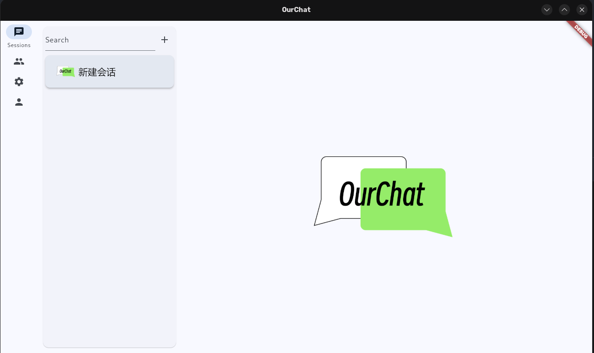
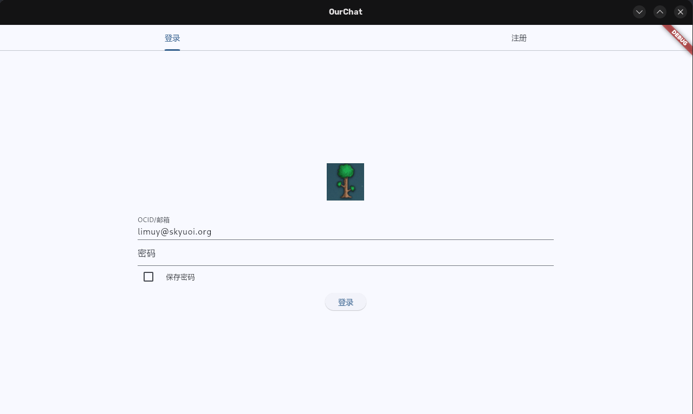
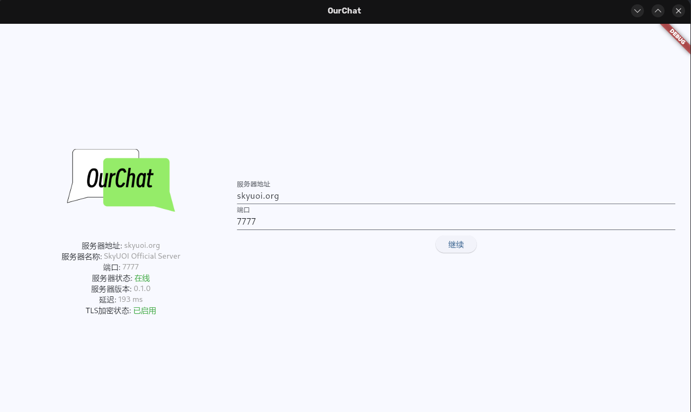
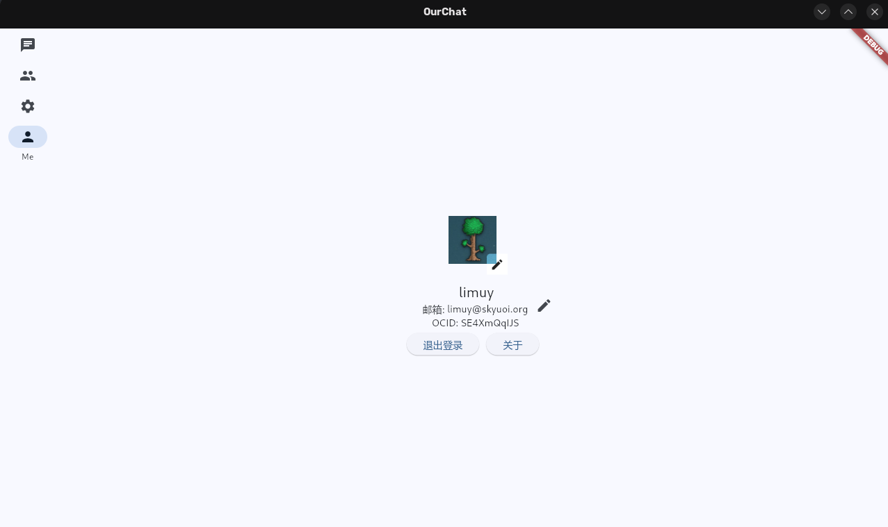

# OurChat 🚀

[](https://codecov.io/github/SkyUOI/OurChat)[](https://github.com/skyuoi/ourchat/blob/main/LICENSE)[](https://github.com/skyuoi/ourchat/stargazers)[](https://github.com/skyuoi/ourchat/issues)[](https://github.com/skyuoi/ourchat/pulls)[](https://github.com/skyuoi/ourchat/releases)[](https://github.com/skyuoi/ourchat/commits)

<!-- markdownlint-disable MD033 -->
<p align="center">
    
</p>
<!-- markdownlint-enable MD033 -->

## 🌟 项目介绍

OurChat 是一个可以在 Linux，Windows, Web 和 macOS 上运行的聊天软件。它通过 Flutter 技术支持所有平台。

⚠️ 该项目正处在高速开发中，并且有大量的工作要做。但它已经有一些基本功能，并且已经可以进行初步试用，试试看吧！

## 试用网页版

在 **[官方web客户端](https://ocapp.skyuoi.org/)** 中体验 OurChat。

## 🖼️ 项目预览

<table align="center">
  <tr>
    <td align="center">
      
      <br><em>💬 主聊天界面</em>
    </td>
    <td align="center">
      
      <br><em>🗨️ 登录界面</em>
    </td>
  </tr>
  <tr>
    <td align="center">
      
      <br><em>😊 欢迎页</em>
    </td>
    <td align="center">
      
      <br><em>⚙️ 关于</em>
    </td>
  </tr>
</table>

## 📱 功能亮点

- 💬 实时消息传递
- 👥 群组聊天
- 🔒 端到端加密
- 🌍 跨平台支持
- 🚀 高性能、低延迟
- 🛠️ 可自托管

## 官方服务器

服务器地址: `skyuoi.org:7777`。在你要开发客户端时，你也可以把它当成开发服务器来辅助开发。服务器使用的 docker 镜像版本是`nightly` (会被定时更新，但不是每天).

## 🚀 愿景与目标

提供一个小到可以轻易在树莓派等设备上运行的聊天软件，为您的公司，家人等搭建属于自己的聊天服务器。与此同时，具备成为大到可以容纳数百万用户的高性能服务端的能力。

🔑 **核心理念**:

- ✅ **自由开放**: 自由，开放是我们设计的初衷，您将会体会到比其余聊天软件多得多的自由
- 🔒 **安全可靠**: 端到端加密等安全保障让 OurChat 能够放心地被您使用
- 🛡️ **隐私保护**: 我们绝对保护您的隐私！

## 🚀 快速开始

### ⚠️ 安全提示

要在生产环境中使用还需要做设置数据库密码等一系列改进，具体参考文档。

### 🖥️ 服务端部署

```shell
cd docker
docker compose up -d
```

更多部署方式请参考 [部署文档](https://ourchat.readthedocs.io/zh-cn/latest/docs/deploy/server-deploy.html)

## 🛠️ 从源代码构建

参见 [构建文档](https://ourchat.readthedocs.io/zh-cn/latest/docs/run/build.html)

## 📚 项目文档

请参考 [文档](https://ourchat.readthedocs.io/zh-cn/latest/)，我们将它部署在了 ReadTheDocs

## 🤝 贡献

请见 [贡献指南](https://ourchat.readthedocs.io/zh-cn/latest/docs/development/contributing.html)

## 🌐 社区

- [Matrix](https://matrix.to/#/#skyuoiourchat:matrix.org)

## 📦 支持的平台

| 平台    | 状态                                                                                                     |
| :------ | :------------------------------------------------------------------------------------------------------- |
| Linux   |      |
| Windows |  |
| macOS   |      |
