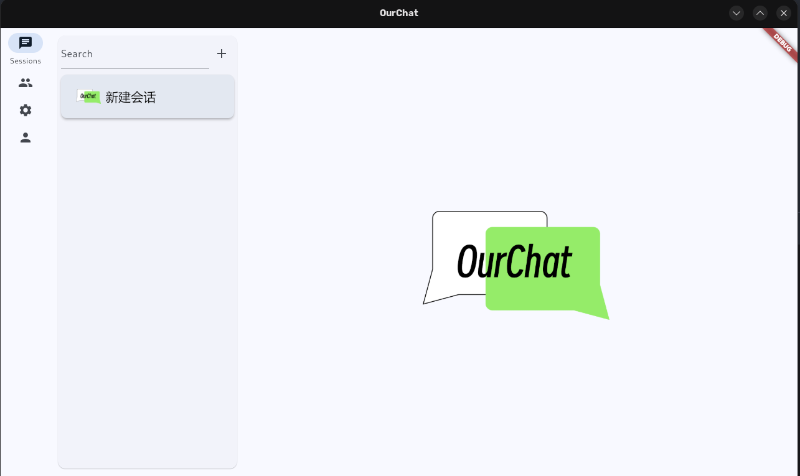
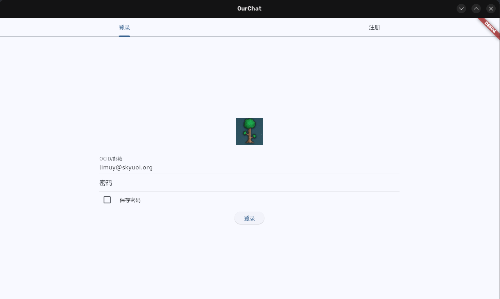
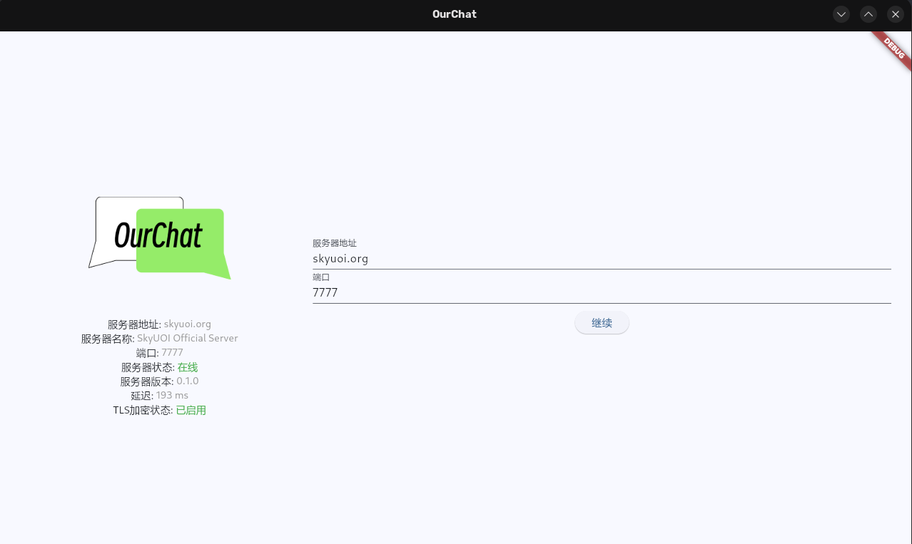
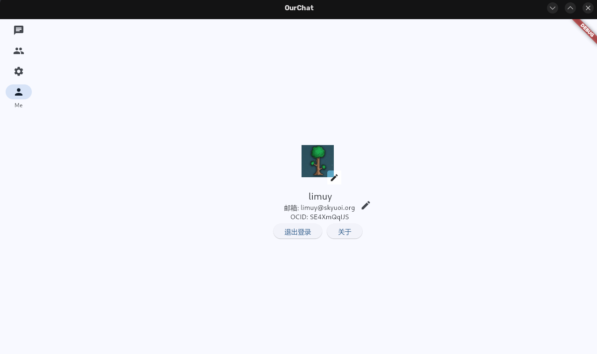

# OurChat 🚀

[](https://codecov.io/github/SkyUOI/OurChat)[](https://github.com/skyuoi/ourchat/blob/main/LICENSE)[](https://github.com/skyuoi/ourchat/stargazers)[](https://github.com/skyuoi/ourchat/issues)[](https://github.com/skyuoi/ourchat/pulls)[](https://github.com/skyuoi/ourchat/releases)[](https://github.com/skyuoi/ourchat/commits)

<!-- markdownlint-disable MD033 -->
<p align="center">
    
</p>
<!-- markdownlint-enable MD033 -->

## [中文](./README-zh.md)

## 🌟 Introduction

OurChat is a chat application for Linux, Windows, Web and macOS. It supports all platforms through Flutter.

⚠️ The project is under rapid development, and there is also a lot of work to be done. But it has some basic functionalities and is ready for initial use, have a try!

## Try the Web Client

Try OurChat on the **[Official Web Client](https://ocapp.skyuoi.org/)**

## 🖼️ Project Preview

<table align="center">
  <tr>
    <td align="center">
      
      <br><em>💬 Chat </em>
    </td>
    <td align="center">
      
      <br><em>🗨️ Login </em>
    </td>
  </tr>
  <tr>
    <td align="center">
      
      <br><em>😊 Welcome</em>
    </td>
    <td align="center">
      
      <br><em>⚙️ About</em>
    </td>
  </tr>
</table>

## 📱 Feature Highlights

- 💬 Real-time messaging
- 👥 Group chats
- 🔒 End-to-end encryption
- 🌍 Cross-platform support
- 🚀 High performance, low latency
- 🛠️ Self-hostable

## Official Server

Server Address: `skyuoi.org:7777`. If you want to develop the client, you can also use it as your development server to work with. The docker image version it uses is `nightly` (It will be updated regularly but not nightly).

## 🚀 Vision & Plan

Provides a lightweight chat software that can easily run on devices like Raspberry Pi, allowing you to set up your own
chat server for your company, family, etc. At the same time, it has the potential to scale up to a high-performance
server capable of accommodating millions of users.

🔑 **Core Principles**:

- ✅ **Freedom & Openness**: Freedom and openness are the principles of our design, and you will experience much more freedom than other chat software
- 🔒 **Security**: End-to-end encryption and other security guarantees make OurChat a service you can trust
- 🛡️ **Privacy**: We absolutely protect your privacy!

## 🚀 Quick Start

### ⚠️ Security Notice

If you want to use it in the product environment, you should do a series of improvements, such as changing
the password of database. More information please refer to document.

### 🖥️ Server Deployment

```shell
cd docker
docker compose up -d
```

The compose files are layered: `compose.base.yml` holds the shared service
definitions and is pulled in through Compose `include:` by the thin variants —
`compose.yml` (alpine, used by the command above) and `compose.debian.yml`
(debian). Invoking a variant directly keeps working, e.g.
`docker compose -f docker/compose.debian.yml up -d`. Compose v2.20+ is
required for `include:`.

Defaults worth knowing about (commands below assume the `docker/` directory):

- **Network exposure**: the server ports are published to `127.0.0.1` only
  (`127.0.0.1:7777:7777` HTTP/WebSocket and `127.0.0.1:7779:7779` gRPC), so
  nothing outside the host can reach the plaintext server. Put a
  TLS-terminating reverse proxy in front of it, or edit the mappings in
  `compose.yml` to `"7777:7777"` / `"7779:7779"` (or
  `"192.168.1.10:7777:7777"` to bind one specific interface) to expose it
  directly.
- **Data**: all runtime state lives in named Docker volumes — postgres,
  redis and rabbitmq data, server logs, uploaded files
  (`/app/files_storage`) and the server configuration (`/etc/ourchat`).
  `docker compose down` and image upgrades keep the data;
  `docker compose down -v` is the explicit way to wipe it. `../resource`
  (logo, e-mail template, web panel) stays a read-only bind mount on
  purpose: it is host-versioned static input, not runtime state.
- **Configuration**: the `ourchat_config` volume is seeded from the
  image's built-in `/etc/ourchat` on first start, so the stack works out
  of the box. Afterwards you edit the copy inside the volume (image
  upgrades no longer overwrite your config):

  ```shell
  docker cp config/ourchat.toml "$(docker compose ps -q OurChatServer)":/etc/ourchat/ourchat.toml
  docker compose restart OurChatServer
  ```

  or attach a temporary bind mount with a throwaway container to edit the
  files in place.

For More deployment methods, please refer
to [deployment document](https://ourchat.readthedocs.io/en/latest/docs/deploy/server-deploy.html)

## 🛠️ Build from source

Refer to [Build Document](https://ourchat.readthedocs.io/en/latest/docs/run/build.html)

## 📚 Documentation

Refer to [Documentation](https://ourchat.readthedocs.io/en/latest/), we deploy it to ReadTheDocs

## 🤝 Contribution

Please see [CONTRIBUTING](https://ourchat.readthedocs.io/en/latest/docs/development/contributing.html)

## 🌐 Community

- [Matrix](https://matrix.to/#/#skyuoiourchat:matrix.org)

## 📦 Supported Platforms

| Platform | Status                                                                                                   |
| :------- | :------------------------------------------------------------------------------------------------------- |
| Linux    |      |
| Windows  |  |
| Macos    |      |
